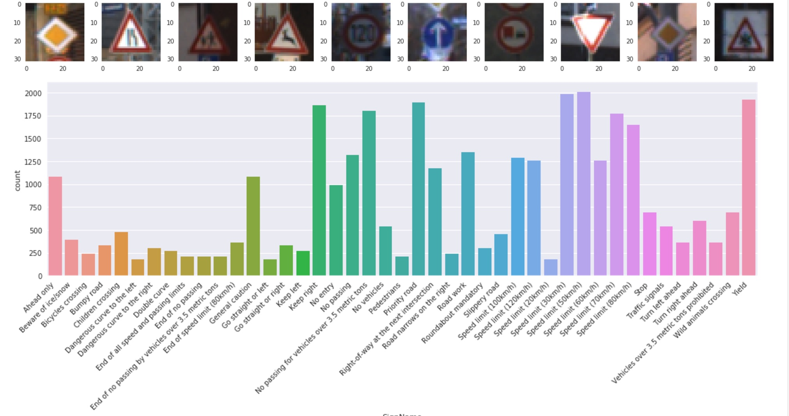
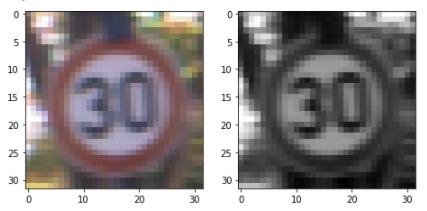
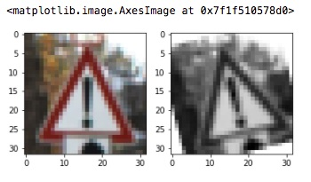
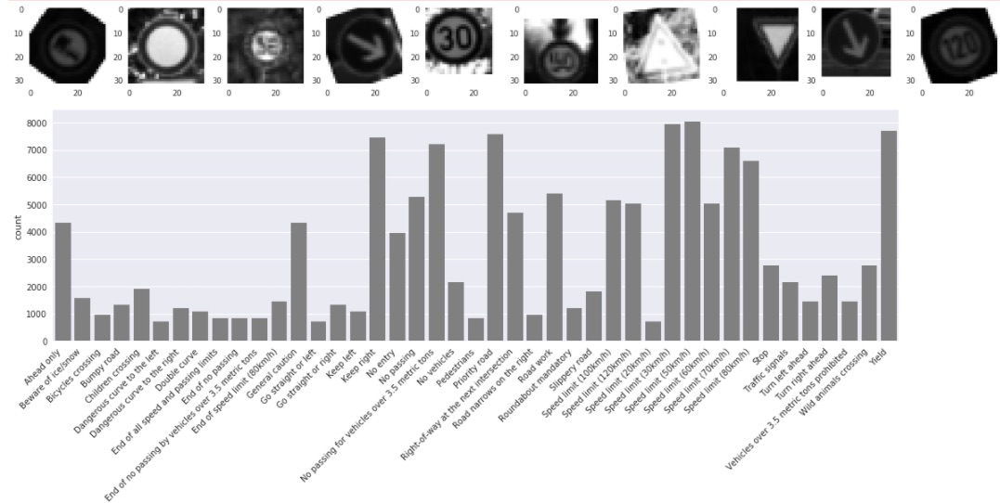

# **Traffic Sign Recognition** 
## Aditya Dhulipala
### 08/21/2017

---

**Build a Traffic Sign Recognition Project**

The goals / steps of this project are the following:
* Load the data set (see below for links to the project data set)
* Explore, summarize and visualize the data set
* Design, train and test a model architecture
* Use the model to make predictions on new images
* Analyze the softmax probabilities of the new images
* Summarize the results with a written report


[//]: # (Image References)

[image1]: ./examples/visualization.jpg "Visualization"
[image2]: ./examples/grayscale.jpg "Grayscaling"
[image3]: ./examples/random_noise.jpg "Random Noise"
[image4]: ./examples/placeholder.png "Traffic Sign 1"
[image5]: ./examples/placeholder.png "Traffic Sign 2"
[image6]: ./examples/placeholder.png "Traffic Sign 3"
[image7]: ./examples/placeholder.png "Traffic Sign 4"
[image8]: ./examples/placeholder.png "Traffic Sign 5"

## Rubric Points
### Here I will consider the [rubric points](https://review.udacity.com/#!/rubrics/481/view) individually and describe how I addressed each point in my implementation.  

---
### Writeup / README

#### 1. Provide a Writeup / README that includes all the rubric points and how you addressed each one. You can submit your writeup as markdown or pdf. You can use this template as a guide for writing the report. The submission includes the project code.

You're reading it! and here is a link to my [project code](https://github.com/adhulipa/CarND-Traffic-Sign-Classifier-Project/blob/master/Traffic_Sign_Classifier.ipynb)

### Data Set Summary & Exploration

#### 1. Provide a basic summary of the data set. In the code, the analysis should be done using python, numpy and/or pandas methods rather than hardcoding results manually.

I used the pandas library to calculate summary statistics of the traffic
signs data set:

* The size of training set is 34799
* The size of the validation set is 4410
* The size of test set is 12630
* The shape of a traffic sign image is (32, 32, 3)
* The number of unique classes/labels in the data set is 43

Number of training examples = 34799
Number of validation examples = 4410
Number of testing examples = 12630
Image data shape = (32, 32, 3)
Number of classes = 43

```
        ClassId              SignName
count     34799                 34799
unique       43                    43
top           2  Speed limit (50km/h)
freq       2010                  2010
```

#### 2. Include an exploratory visualization of the dataset.

Here is an exploratory visualization of the data set. 
1. The first row of images depict the signs themselves. It's easy to see how certain signs may be hard to distinguish from each other because of image resolution, brigtness, camera angle and many other features.

2. I plotted a histogram of occurrences to show how many example we have for each type of sign. You can see that this is not a uniform distribution. This is a very important observation. This bar chart highly influenced my data augmentation techniques. I'll shed more light on that in a later section.



### Design and Test a Model Architecture

#### 1. Describe how you preprocessed the image data. What techniques were chosen and why did you choose these techniques? Consider including images showing the output of each preprocessing technique. Pre-processing refers to techniques such as converting to grayscale, normalization, etc. (OPTIONAL: As described in the "Stand Out Suggestions" part of the rubric, if you generated additional data for training, describe why you decided to generate additional data, how you generated the data, and provide example images of the additional data. Then describe the characteristics of the augmented training set like number of images in the set, number of images for each class, etc.)

I experimented with various technique:
* Color space transforms such as YUV, YCrCb and Grayscale
* Normalization technique using GlobalContrastNorm & a simple norm function suggested in the project

As a first step, I decided to convert the images to grayscale because when it comes to traffic signs, what's most interesting are the edges. Although many traffic signs have distincive colors, for the most part they range from a set of 3-4 colors. If our goal was to classify signs into 3-4 specific classes (such as "Regulatory Sign", "Warning sign" etc) then color would be a useful feature to train against. Instead, our goal here is to classify at a higher level of granularity (i.e. not just whether it's a warning-sign but we need to distiguish between a "railroad crossing" sign from a "deer crossing" sign. Hence, color is not useful but rather edges.


Here is an example of a traffic sign image before and after grayscaling.



As a last step, I normalized the image data because numeric values can vary wildly between similar images. It helps to train the network faster if we restrict them to be within a specific range without affecting the image itself.

I decided to generate additional data because this is probably the single most important step of my pipeline that improved my network. The neural network works off of the numeric values that represent the image. However, we know that the traffic sign doesn't change drastically if it's a little to the left or right, or if it's sunny or dark or if we're looking at from an angle. (In fact, we'd be able to recognize most signs even if we were driving upside down. Haha (Definitely not a good idea though :))

But even making these slight adjustments to the traffic sign would cause the numeric values representing it to vary significantly. Therefore, it helps our model build resillience to slight variations and help detect signs better.

Initially, I planned to augment data such that all the signs would have equal examples. That is, I wanted to create a uniform distribution of the training examples. However, I later abandoned this idea after discussing this with other students in the term. I realized a important feature of our model should be to predict the sign accurately in the face of ambiguity. Having more examples of a sign (say 50 kph) over another (say 60kph) will lead the model to predict an new sign as being 50kph over 60kph with higher probability.				

This turned out to be very good judgement because in one of my previous runs of the project my model incorrectly predicted a new 60kph sign from the web as being 50kph.
To add more data to the the data set, I used the following techniques because ... 

Here is an example of an original image and an augmented image:



The difference between the original data set and the augmented data set is the following. Notice that the distribution is largely the same as earlier but now we have nearly 3 times more examples of each image.

		

#### 2. Describe what your final model architecture looks like including model type, layers, layer sizes, connectivity, etc.) Consider including a diagram and/or table describing the final model.

My final model consisted of the following layers:

| Layer         		|     Description	        					| 
|:---------------------:|:---------------------------------------------:| 
| Input         		| 32x32x1 Grayscale image   					| 
| Convolution 5x5     	| 1x1 stride, valid padding, outputs 28x28x28 	|
| RELU					|												|
| Max pooling	      	| 2x2 stride,  outputs 14x14x28 				|
| Dropout   	      	| Prob of 0.9 		                         	|
| Convolution 5x5	    | 1x1 stride, valid padding, outputs 10x10x32	|
| RELU					|												|
| Max pooling	      	| 2x2 stride,  outputs 5x5x32 		      		|
| Dropout   	      	| Prob of 0.9 		                         	|
| Fully connected		| 800 -> 400  									|
| Dropout   	      	| Prob of 0.9 		                         	|
| Fully connected		| 400 -> 120  									|
| Fully connected		| 120 -> 84  									|
| Fully connected		| 84 -> 43  									|
| Softmax				|  _        									|
|						|												|


#### 3. Describe how you trained your model. The discussion can include the type of optimizer, the batch size, number of epochs and any hyperparameters such as learning rate.

I went through at least a dozen iteration of tuning these parameters. You can find various values I tried in my project's git history.

Finally I converged on using:
* 20 EPOCHS
* * I experimented with values from 15-50. It looked like 20 was pretty much where point at which the model converged. Further improvements to accuracy can be made through a more complex model.

* 120 samples as batch size
* * It was interesting to learn that model performance was inversely proportional to batch size. I ran iterations where I tuned thisfrom 64-512. Choosing a batch size of 128 was pretty good. I cranked it down to 120 just for kicks.

* A learning rate of 0.0009
* * I tried out various values from 0.0001 to 0.001. (Side note: Just for laughs, I even tried a setting of 0.1 and saw that the loss kept increasing!)

* I used an AdamOptimizer to minimize the loss function.

#### 4. Describe the approach taken for finding a solution and getting the validation set accuracy to be at least 0.93. Include in the discussion the results on the training, validation and test sets and where in the code these were calculated. Your approach may have been an iterative process, in which case, outline the steps you took to get to the final solution and why you chose those steps. Perhaps your solution involved an already well known implementation or architecture. In this case, discuss why you think the architecture is suitable for the current problem.

My final model results were:
* training set accuracy of 96.7%
* validation set accuracy of 95.9%
* test set accuracy of 94%

If an iterative approach was chosen:
* What was the first architecture that was tried and why was it chosen?
* * I extended the LeNet arch. to have 9 layers with 6 layers of convolutions and 3 fully connected layers. Each convlution layer had two convolution operations with relu activate, max pooling and dropout of 0.5
* * I chose this arch because I belived that increasing the coplexity of the network arbitrarily would help performance. I was wrong! I later converged to using a well known architecture such as LeNet and tweaked it to suit this project. 

* What were some problems with the initial architecture?
* * The validation accuracy never rose over 10%
* * The major problem with this architecture was that the dropout was way too aggressive. Dropping 50% of the weights led to a situation where the model could not rely on any weights for most of the time and thus led to underfitting.
* * There were many other problems as well (such as complexity of the model for the sake of complexity)
* How was the architecture adjusted and why was it adjusted? Typical adjustments could include choosing a different model architecture, adding or taking away layers (pooling, dropout, convolution, etc), using an activation function or changing the activation function. One common justification for adjusting an architecture would be due to overfitting or underfitting. A high accuracy on the training set but low accuracy on the validation set indicates over fitting; a low accuracy on both sets indicates under fitting.
* * I first made the change of using a simple model arch with effective filter sizes to capture enough depth-of-field in the images. In my initial arch I had smaller but many filters, i.e. I had 3 3x3 filters. I later changed this to have 2 5x5 filters.
* * I also noticed that my model slightly overfitting (training accuracy at 97% vs validation accuracy at 92%). To combat this I introduced dropout into the model at each of the first 3 layers (i.e. 2 convs & 1 fully-connected). My reasoning behind this is that these 3 layers among them have the bulk of the weights parameters. The combinations from the sheer orders of the matrices implies that if there were any weights that disproportionately influenced the model then it is very likely that they are from these 3 layers. I introduced dropout with a keep_prob of 90% and this tremendously helped correct overfitting in my model.
* * The major bulk of the improving the validation accuracy was by efficient pre-processing of the data. Specifically, having normalized and augmented data helped with improving the model performance.
* Which parameters were tuned? How were they adjusted and why?
* * I tuned number of layers, epocs, batch size, dropout keep_prob, convolution filter sizes. 
* * The main adjustments that helped were from the number of layers and filter sizes. I adjusted number of layers to be a tweaked version of LeNet. The reasoning behind this is that complexity (of the model) for the sake of complexity is not a good idea. Adapting a model that is known to work well with certain dimensions of input helps.
* I've described how I adjusted the other params in prior sections of this doc.

* What are some of the important design choices and why were they chosen? For example, why might a convolution layer work well with this problem? How might a dropout layer help with creating a successful model?
* * The two most important design choices were the use of larger filter (i.e. 5x5) with large depth (i.e. 28) and the introduction of dropout. I've described how these two choices affected my performance in the prior question.

If a well known architecture was chosen:
* What architecture was chosen?
* * I used a modified LeNet
* Why did you believe it would be relevant to the traffic sign application?
* * LeNet works well with images of this size. I also read the paper referred to in the project description and the authors presented results that justified the effectiveness of this architecture (http://yann.lecun.com/exdb/publis/pdf/sermanet-ijcnn-11.pdf)
* How does the final model's accuracy on the training, validation and test set provide evidence that the model is working well?
 * * A high accuracy on test images (i.e. images that the model has never seen before) and being able to accurately predict the class of the traffic sign imply that the model is working well.

###Test a Model on New Images

#### 1. Choose five German traffic signs found on the web and provide them in the report. For each image, discuss what quality or qualities might be difficult to classify.

Here are five German traffic signs that I found on the web:

![alt text][image4] ![alt text][image5] ![alt text][image6] 
![alt text][image7] ![alt text][image8]

The first image might be difficult to classify because ...

####2. Discuss the model's predictions on these new traffic signs and compare the results to predicting on the test set. At a minimum, discuss what the predictions were, the accuracy on these new predictions, and compare the accuracy to the accuracy on the test set (OPTIONAL: Discuss the results in more detail as described in the "Stand Out Suggestions" part of the rubric).

Here are the results of the prediction:

| Image			        |     Prediction	        					| 
|:---------------------:|:---------------------------------------------:| 
| Stop Sign      		| Stop sign   									| 
| U-turn     			| U-turn 										|
| Yield					| Yield											|
| 100 km/h	      		| Bumpy Road					 				|
| Slippery Road			| Slippery Road      							|


The model was able to correctly guess 4 of the 5 traffic signs, which gives an accuracy of 80%. This compares favorably to the accuracy on the test set of ...

####3. Describe how certain the model is when predicting on each of the five new images by looking at the softmax probabilities for each prediction. Provide the top 5 softmax probabilities for each image along with the sign type of each probability. (OPTIONAL: as described in the "Stand Out Suggestions" part of the rubric, visualizations can also be provided such as bar charts)

The code for making predictions on my final model is located in the 11th cell of the Ipython notebook.

For the first image, the model is relatively sure that this is a stop sign (probability of 0.6), and the image does contain a stop sign. The top five soft max probabilities were

| Probability         	|     Prediction	        					| 
|:---------------------:|:---------------------------------------------:| 
| .60         			| Stop sign   									| 
| .20     				| U-turn 										|
| .05					| Yield											|
| .04	      			| Bumpy Road					 				|
| .01				    | Slippery Road      							|


For the second image ... 

### (Optional) Visualizing the Neural Network (See Step 4 of the Ipython notebook for more details)
####1. Discuss the visual output of your trained network's feature maps. What characteristics did the neural network use to make classifications?


